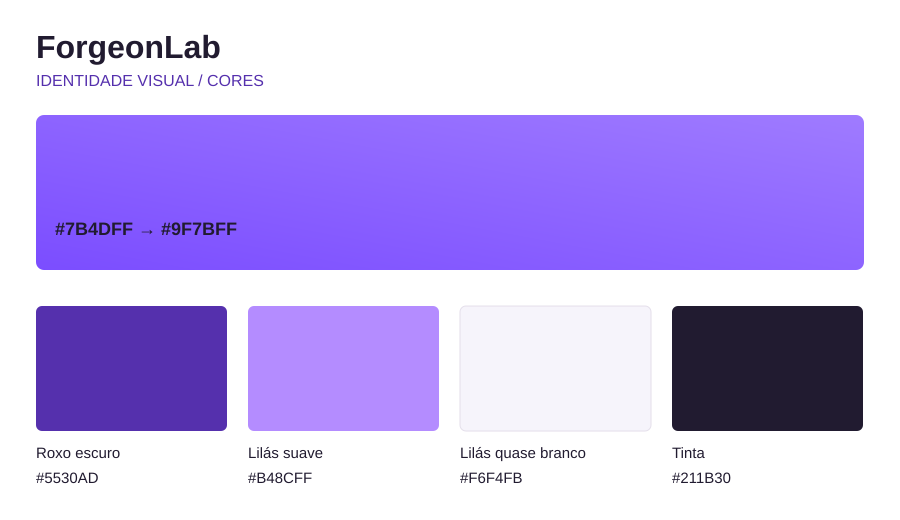

# Cores da ForgeonLab

Paleta de referência para site, apresentações e peças digitais. O gradiente principal foi recuperado dos estilos do site anterior (src/app/core/components/button/button.component.scss, commit ed7e0f0): linear-gradient(135deg, #7B4DFF, #9F7BFF). Esses são os dois pontos de cor da assinatura visual. O roxo intermediário abaixo também existia como cor secundária no site anterior. O roxo escuro é um tom de interface derivado para manter leitura em botões e links.

| Papel | Tom | Hex | Uso |
| --- | --- | --- | --- |
| Base do gradiente | Roxo Forgeon | #7B4DFF | Início do gradiente, detalhes gráficos e foco |
| Fim do gradiente | Lilás Forgeon | #9F7BFF | Final do gradiente e acentos |
| Apoio | Lilás suave | #B48CFF | Destaques em fundo escuro |
| Interface | Roxo escuro | #5530AD | Botões e texto de links sobre branco |
| Superfície | Lilás quase branco | #F6F4FB | Faixas e fundos secundários |
| Texto | Tinta | #211B30 | Texto principal |

## Gradiente oficial recuperado

    background: linear-gradient(135deg, #7B4DFF 0%, #9F7BFF 100%);

No código, use var(--forgeon-gradient). Os tons estão definidos em src/styles.scss como variáveis CSS --forgeon-*. Use o gradiente para assinatura visual, acentos e elementos grandes. Para texto branco em botões, use o roxo escuro sólido: a ponta lilás do gradiente é clara demais para garantir contraste de texto branco comum.

## Direção de uso

- O nome da marca é **ForgeonLab**, sempre junto. Evite “Lab” como apelido isolado.
- Prefira tipografia, espaço e detalhes roxos a fundos com muitos efeitos.
- Guaru, Pingy e Disquete são o destaque da abertura: chegam em sequência pelo portal roxo e flutuam brevemente. Nas demais seções, apoiam a marca sem ocupar o lugar dos produtos e pedidos.
- Imagens conceituais devem ser identificadas como estudo ou conceito. Troque por fotos reais assim que houver peças fotografadas e autorizadas.
- Ao apresentar um pedido, descreva materiais, dimensões, acabamento, prazo e preço confirmados pela equipe; não prometa essas características antes da conversa.

## Movimento na abertura

O portal se abre e os personagens chegam em sequência: Guaru faz um voo curto, Pingy dá um salto e Disquete pousa com um pequeno balanço. A chegada dura cerca de 3,5 segundos, seguida de gestos suaves e contínuos próprios de cada personagem. O botão “Pausar movimento” interrompe a cena; “Rever a chegada” reinicia a sequência. A preferência de movimento reduzido desativa as animações e esconde esses controles. No celular, os personagens aparecem logo abaixo do título, antes da apresentação e dos botões de pedido. As ilustrações originais são preservadas.

## Cenário da abertura

O banner tem céu azul em degradê, sol dourado e nuvens arredondadas, com gramado de ponta a ponta. O gramado e as nuvens são SVGs leves em public/scenery. O céu usa cores claras, por isso título, parágrafo e controles têm texto escuro, e o botão principal é roxo. O portal continua usando o gradiente roxo oficial. As cores da paisagem pertencem à ilustração e não substituem a paleta da ForgeonLab.
